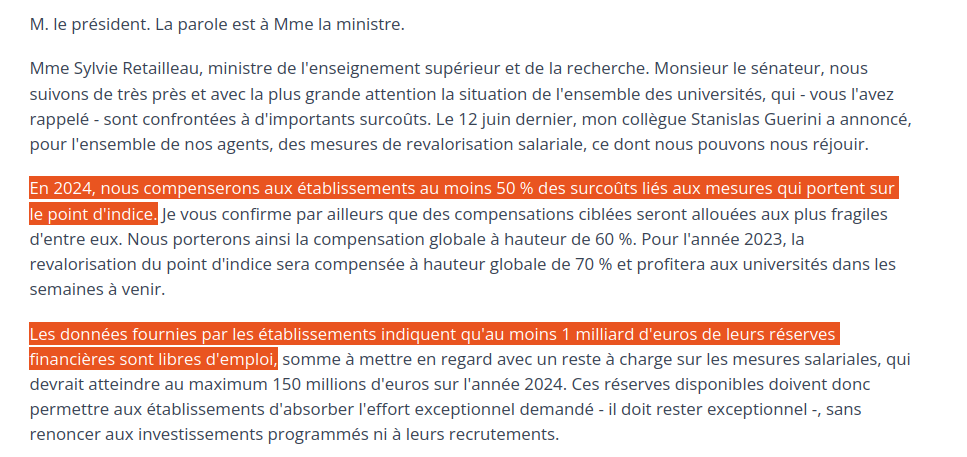

```{r setup, include=FALSE}
knitr::opts_chunk$set(echo=FALSE, warning = FALSE, message = FALSE)
knitr::opts_chunk$set(fig.align="center")
knitr::opts_chunk$set(pdf.options(encoding = "CP1250"))
knitr::opts_chunk$set(dev = "cairo_pdf")

library(tidyverse)
library(ggthemes)
library(cowplot)
library(kpiESR)
library(wikidataESR)
library(ggrepel)

library(ggcpesrthemes)
theme_set(theme_cpesr())

rentrée.ref = 2012
rentrée.last = 2020

source("fbpESR.R")
fbp <- fbp_get_data(libellé, rentrée.last, rentrée.ref)

#plots <- kpiESR::kpiesr_plot_all(rentrée.last, fbp$UAI, style.kpi=small_style)

wdid <- substr(fbp$etab$url.wikidata,33,50)[1]
wikidataESR::wdesr_load_cache()
```

---
title: "Fiche Bilan Personnalisée : `r fbp$Libellé`"
author: |
  | CPESR
  | [www.cpesr.fr](https://cpesr.fr)
  | contact@cpesr.fr
date: "`r format(Sys.time(), '%d/%m/%Y')`"
classoption: "aspectratio=169"
urlcolor: blue
linkcolor: white
fontsize: 8pt
lang: "fr-FR"
---

## Introduction

Cette fiche bilan vise à objectiver les politiques d'établissement, sur la base d'informations publiques et uniformisée par le Ministère, auxquelles des données issues des bilans sociaux peuvent être ajoutées.

Elle ne prétend ni couvrir l'intégralité des politiques universitaires, ni capturer toute la complexité des sujets qu'elle aborde. 

La méthodologie est essentiellement celle des [tableaux de bord de l'ESR](https://cpesr.fr/2020/09/tableau-de-bord-esr/).

```{r, out.height = "20%"}
knitr::include_graphics("files/logo_cpesr_sackersgothic.pdf")
``` 
- Portail des données ouvertes du MESRI : https://data.enseignementsup-recherche.gouv.fr
- Wikidata ([guide d'édition](https://github.com/cpesr/wikidataESR/blob/master/Rmd/wikidataESR.md)) : `r paste0("https://www.wikidata.org/wiki/",wdid)` 
- Formulaire de création d'une fiche : https://enquete.cpesr.fr/index.php/881846

# Grands enjeux du moment

## Réformes : Entrée en Maternelle (2009)

```{r, out.width = "100%"}
knitr::include_graphics("files/waffles-bac-1.pdf")
``` 

## Réformes : Obtention du Bac (2023)

```{r, out.width = "100%"}
knitr::include_graphics("files/waffles-bac-2.pdf")
``` 

## Réussite vs. Exigence : Le discours

```{r, out.width = "100%"}
knitr::include_graphics("files/AEF-LM.png")
``` 

- Anne-Sophie Barthez, DGESIP en 2019.

Dépêche AEF « La distinction entre undergraduate et graduate doit conduire à réinterroger tout le système de formation »

https://www.aefinfo.fr/depeche/616359

## Réussite vs. Exigence : Les données

```{r LM.univB, fig.asp=8/16, fig.width=7, out.width="100%", fig.align='center'}
load(file="files/sise.RData")

bind_rows(
  sise %>%
    group_by(Rentrée,Niveau = paste(LMD, substr(NIVEAU,2,2), sep="")) %>%
    summarise(Etudiants = sum(Etudiants)) %>%
    mutate(Etablissement = "ESR"),
  sise %>%
    filter(Etablissement == libellé) %>%
    group_by(Rentrée,Niveau = paste(LMD, substr(NIVEAU,2,2), sep="")) %>%
    summarise(Etudiants = sum(Etudiants)) %>%
    mutate(Etablissement = libellé) ) %>%

  filter(Niveau %in% c("L3","M1")) %>%
  mutate(Rentrée = ifelse(Niveau == "L3", Rentrée+1,Rentrée)) %>%
  filter(Rentrée != 2012, Rentrée != 2023) %>%
  ggplot(aes(x=Rentrée, y= Etudiants, color=Niveau)) +
  geom_line(linewidth = 1.5) + geom_point(shape = 21, stroke = 2, size = 2, fill="white") + 
  scale_x_continuous(labels = ~ paste0("L3 ", .x-1,"\nM1 ",.x), breaks = seq(2011,2030,2), name="Cohorte") +
  scale_y_continuous(labels = ~ paste0(.x/1e3,"k"), name = "Inscriptions étudiantes") +
  facet_wrap(.~Etablissement, scales = "free_y") +
  ggtitle("Etudiant⋅e⋅s  inscrit⋅e⋅s en L3 à l'année N et M1 à l'année N+1" )
```


## Rémunérations vs. dotation : Le discours

```{r, out.width = "70%"}

``` 

- Sylvie Retailleau, Ministre ESR en 2023

Question orale n°0915S « Situation budgétaire des universités et particulièrement de Le Mans Université »

https://www.senat.fr/questions/base/2023/qSEQ23110915S.html


## Rémunérations vs. dotation : Les données

```{r scsp.vs.ms3, fig.asp=8/16, out.width="100%"}

kpiESR::esr %>%
  filter(Etablissement %in% c(type,libellé), Rentrée > 2008) %>%
  mutate(Etablissement = factor(Etablissement, levels=c(type,libellé))) %>%
  mutate(diff = kpi.FIN.S.SCSP-kpi.FIN.S.masseSalariale) %>% 
  ggplot(aes(x=Rentrée,y=diff, color=diff)) +
  geom_hline(yintercept = 1) +
  geom_line(size=1) + geom_point(shape = 21, stroke=2,size=2,fill="white") +
  scale_x_continuous(breaks = scales::pretty_breaks()) +
  scale_y_continuous(labels = ~ paste(.x/1e6,"M€"), name = "SCSP-MS") +
  scale_color_distiller(palette="Reds") +
  facet_wrap(.~Etablissement, scales = "free_y") +
  ggtitle("Différence entre SCSP et masse salariale des universités") +
  theme(legend.position = "None", panel.grid.minor.x = element_blank())
```


```{r, eval=FALSE}
knitr::knit_exit()
```


```{r struct.setup, include=FALSE, eval=include_wikidata}
cat("\n# Structure et organisation\n\n")
knitr::opts_chunk$set(fig.width = 6, fig.height = 4, out.height = "60%", fig.align="center")
```

```{r plot_histoire, results='asis', echo = FALSE, warning = FALSE, message=FALSE, eval=include_wikidata}
make_slide(plot_histoire, "histoire", "Historique",
"L'historique montre les grandes étapes qui ont conduit à l'établissement actuel.",
"- Quelles fusions, séparations ou changement de statut sont envisagées ?")
```

```{r plot_association, results='asis', fig.width = 10, fig.height = 5, echo = FALSE, message=FALSE, eval=include_wikidata}
make_slide(plot_association, "association", "Associations et affiliations",
"Les associations montrent les adhésions à des organisations externes à l'établissement.",
"- Quelles créations ou suppressions d'associations et affiliations sont envisagées ?")
```

```{r plot_composition, results='asis', fig.width = 10, fig.height = 5, echo = FALSE, message=FALSE, eval=include_wikidata}
make_slide(plot_composition, "composition", "Composition",
"La composition montre la structuration interne de l'établissement.",
"- Faut-il réduire ou augmenter le nombre d'unités-composantes ?
- Faut-il ajouter ou supprimer un niveau intermédiaire ?")
```

```{r wdsave, include = FALSE, eval=TRUE, eval=include_wikidata}
wikidataESR::wdesr_save_cache()
```

# Positionnements

```{r map.setup}
knitr::opts_chunk$set(fig.width = 10, fig.height = 6, out.height = "90%", out.width = NULL, fig.align = "center")
```


```{r pos.etuXtit, results='asis'}
make_slide_simple(
plot_map(fbp, xvar="kpi.ETU.P.effectif", yvar="kpi.ENS.P.effectif+kpi.BIA.P.effectif", xlabel=100,ylabel=5000) +
  xlab("Effectifs étudiants") + ylab("Effectifs enseignants et BIATSS"),
  "Etudiants et personnels")
```


```{r pos.biaXens, results='asis'}
make_slide_simple(
plot_map(fbp, xvar="kpi.ENS.P.effectif", yvar="kpi.BIA.P.effectif", xlabel=100,ylabel=2700) +
  xlab("Effectifs enseignants") + ylab("Effectifs BIATSS"),
  "Enseignants et personnels BIATSS")
```

  
```{r pos.xPetu, results='asis'}
make_slide_simple(
  plot_map(fbp, xvar="kpi.K.resPetu", yvar="kpi.K.ensPetu", xlabel=4100,ylabel=5) +
      scale_x_continuous(label = ~ paste(.x, "€"), name="Budget par étudiant", limits=c(4000,13000)) +
      scale_y_continuous(name="Enseignants titulaires pour 100 étudiants"),
  "Budget et taux d'encadrement pédagogique")
```

```{r pos.fin, results='asis'}
make_slide_simple(
  plot_map(fbp, xvar="kpi.K.forPetu", yvar="kpi.K.recPect", xlabel=50,ylabel=35000) +
    scale_x_continuous(label = ~ paste(.x, "€"), name="Recette propres formation par étudiant", limits = c(0,1000)) +
    scale_y_continuous(label = ~ paste(.x/1e3, "k€"), name="Recette propres recherche par EC titulaire", limits = c(0,50000)),
  "Recettes propres formation et recherche")
```

```{r pos.LxM, results='asis'}
make_slide_simple(
  plot_map(fbp, xvar="kpi.ETU.S.cycle1_L", yvar="kpi.ETU.S.cycle2_M+kpi.ETU.S.cycle3_D", xlabel=100,ylabel=20000) +
  scale_x_continuous(name="Proportion d'étudiants en 1er cycle (L)") +
  scale_y_continuous(name="Proportion d'étudiants en 2e et 3e cycle (M+D)"),
  "Equilibre premier et second/troisième cycle")
```

```{r pos.titXtit, results='asis'}
make_slide_simple(
  plot_map(fbp, xvar="kpi.ENS.S.titulaires/kpi.ENS.P.effectif", yvar="kpi.BIA.S.titulaires/kpi.BIA.P.effectif", xlabel=0.50,ylabel=0.75) +
    scale_x_continuous(label = scales::percent, name="Proportion d'E-EC titulaires", limits = c(0.50,0.90)) +
    scale_y_continuous(label = scales::percent, name="Proportion de BIATSS titulaires", limits = c(0.40,0.85)),
  "Titularité des enseignants et BIATSS")
```


```{r pos.ensXbia, results='asis'}
make_slide_simple(
  plot_map(fbp, xvar="kpi.ENS.P.effectif/kpi.ETU.P.effectif*100", yvar="kpi.BIA.P.effectif/kpi.ETU.P.effectif*100", xlabel=2,ylabel=7) +
    scale_x_continuous(name="Nombre d'E-EC pour 100 étudiants", limits=c(2,8)) +
    scale_y_continuous(name="Nombre de BIATSS pour 100 étudiants", limits=c(2,8)),
  "Encadrements pédagogique et administratif")
```


# Quatre profils : etudiant, BIATSS, enseignant, et budgétaire.

```{r kpi.setup}
knitr::opts_chunk$set(fig.width = 10, fig.height = 4, out.height = NULL, out.width="100%", fig.align="center")
```


```{r plot_profil_etu, results='asis', echo = FALSE, warning = FALSE}
make_slide(plot_kpiesr_profil, "etu",
           "Le profil étudiant",
"Le profil étudiant est une représentation de l'offre de formation de l'établissement, en terme de pyramidage LMD, et de développement des diplômes d'université (DU ou diplôme d'établissement).",
"- Quelles modifications du profil LMD sont envisagées ?
- Quelles évolutions pour les DU (et autres formations payantes) sont envisagées ?")
```

```{r plot_evol_etu, results='asis', echo = FALSE, warning = FALSE}
make_slide(plot_kpiesr, "etu.evol", "Le profil étudiant : évolution", median = FALSE,
"Le profil étudiant est une représentation de l'offre de formation de l'établissement, en terme de pyramidage LMD, et de développement des diplômes d'université (DU ou diplôme d'établissement).",
"- L'évolution passée est-elle souhaitable, regrettable ou inévitable ?
- Quelle devra être l'évolution future et comment y arriver ? Avec quelle priorité ?")
```


```{r plot_profil_bia, results='asis', echo = FALSE, warning = FALSE}
make_slide(plot_kpiesr_profil, "bia",
           "Le profil BIATSS",
"Le profil BIATSS est une représentation des effectifs, permettant de constater la répartition entre catégories et titularité","")

```

```{r plot_evol_bia, results='asis', echo = FALSE, warning = FALSE}
# lfc = list( labels = kpiesr_lfc$ENS$labels[-5],
#             factors = kpiesr_lfc$ENS$factors[-5],
#             colors = kpiesr_lfc$ENS$colors[-5],
#             desc = kpiesr_lfc$ENS$desc[-5] )
make_slide(plot_kpiesr, "bia.evol", "Le profil BIATSS : évolution", median = FALSE,
"Le profil BIATSS est une représentation des effectifs, permettant de constater la répartition entre catégories et titularité","")
```


```{r plot_profil_ens, results='asis', echo = FALSE, warning = FALSE}
make_slide(plot_kpiesr_profil, "ens",
           "Le profil enseignant",
"Le profil enseignant est une représentation des effectifs, permettant de constater la répartition entre titulaires, enseignants-chercheurs (EC), Doctorants et ATER, et Contrats LRU.",
"- Quelles modifications des effectifs enseignants sont envisagées ?
- Est-ce que le recours aux contrats LRU, Chaires professeur junior et Contrats de mission est envisagée ?")

```

```{r plot_evol_ens, results='asis', echo = FALSE, warning = FALSE}
# lfc = list( labels = kpiesr_lfc$ENS$labels[-5],
#             factors = kpiesr_lfc$ENS$factors[-5],
#             colors = kpiesr_lfc$ENS$colors[-5],
#             desc = kpiesr_lfc$ENS$desc[-5] )
make_slide(plot_kpiesr, "ens.evol", "Le profil enseignant : évolution", median = FALSE,
"Le profil enseignant est une représentation des effectifs, permettant de constater la répartition entre titulaires, enseignants-chercheurs (EC), Doctorants et ATER.^[Le faible effectif et la forte évolution des contrats LRU ne permet pas de tracer leur évolution proprement.]",
"- L'évolution passée est-elle souhaitable, regrettable ou inévitable ?
- Quelle devra être l'évolution future et comment y arriver ? Avec quelle priorité ?")
```


```{r plot_profil_fin, results='asis', echo = FALSE, warning = FALSE}
make_slide(plot_kpiesr_profil, "fin",
           "Le profil budgétaire",
"Le profil budgétaire est une représentation des ressources de l'établissement : ressources complètes, ressources propres (hors subvention pour charge de service public), et proportion des inscription en DU.",
"- Quelles modifications du profil budgétaires sont envisagées ?
- Est-ce que le développement des ressources propres est une priorité ? De quelle manière ?
- Est-ce que le développement des investissements est une priorité ? Pour quoi faire ?")
```

```{r plot_evol_fin, results='asis', echo = FALSE, warning = FALSE}
make_slide(plot_kpiesr, "fin.evol", "Le profil budgétaire : évolution", median = FALSE,
"Le profil budgétaire est une représentation des ressources de l'établissement : ressources complètes, ressources propres (hors subvention pour charge de service public), et proportion des inscription en DU.",
"- L'évolution passée est-elle souhaitable, regrettable ou inévitable ?
- Quelle devra être l'évolution future et comment y arriver ? Avec quelle priorité ?")
```


# Indicateurs clés de performance

```{r profil.setup}
knitr::opts_chunk$set(fig.width = 10, fig.height = 4, out.width = "100%", fig.align="center")
```

```{r profil.k, results='asis', echo = FALSE, warning = FALSE}
make_slide(plot_kpiesr,"k.norm", "Comparaison nationale des indicateurs clés de performance", "Le profil général permet de situer rapidement l'établissement parmi toutes les universités selon les indicateurs clés de performance. Chaque point correspond à un établissement et le violon montre leur distribution. Les lignes horizontales montrent les valeur pour tout l'ESR (plein) et pour les universités (pointillés).")
```


```{r profil.k.evol, results='asis', echo = FALSE, warning = FALSE}
make_slide(plot_kpiesr,"k.evol", "Comparaison nationale de l'évolution des indicateurs clés de performance", "Le profil général permet de situer rapidement l'établissement parmi toutes les universités selon les indicateurs clés de performance. Chaque point correspond à un établissement et le violon montre leur distribution. Les lignes horizontales montrent les valeur pour tout l'ESR (plein) et pour les universités (pointillés).")
```


```{r evol.setup}
knitr::opts_chunk$set(fig.width = 9, fig.height = 2.9, out.width = "90%", fig.align="center")
```


```{r plot_resPetu, results='asis', echo = FALSE, warning = FALSE}
make_slide(plot_evolution, "kpi.K.resPetu", "Le taux de ressources par étudiant", unit = "€",
"Ce rapport entre les ressources de l’établissement et le nombre d’étudiants inscrits en premier et deuxième cycle (L et M) permet de mesurer les ressources dont dispose l’établissement par rapport à la taille de sa population étudiante. Attention : ce taux ne correspond pas à la dépense de l’établissement pour chacun de ses étudiants, et il ne dépend que faiblement de la politique locale.",
"- L'évolution passée est-elle souhaitable, regrettable ou inévitable ?
- Quelle devra être l'évolution future et comment y arriver ? Avec quelle priorité ?",
observation = TRUE)
```


```{r plot_dotPres, results='asis', echo = FALSE, warning = FALSE}
make_slide(plot_evolution, "kpi.K.dotPres", "Le taux de SCSP", small = TRUE,
"Le taux de subvention pour charge de service public (SCSP) mesure les moyens octroyés par l'Etat pour accomplir les missions de service public, parmis toutes les ressources dont dispose l'établissement.",
"- L'évolution passée est-elle souhaitable, regrettable ou inévitable ?
- Quelle devra être l'évolution future et comment y arriver ? Avec quelle priorité ?",
observation = TRUE)
```


```{r plot_ensPetu, results='asis', echo = FALSE, warning = FALSE}
make_slide(plot_evolution, "kpi.K.ensPetu", "Le taux de d'encadrement", unit = "enseignants titulaires pour 100 étudiants",
"Le taux d'encadrement est une mesure de la politique RH de l'établissement. Il indique le nombre d'enseignants titulaires pour 100 étudiants (doctorants non inclus).",
"- L'évolution passée est-elle souhaitable, regrettable ou inévitable ?
- Quelle devra être l'évolution future et comment y arriver ? Avec quelle priorité ?",
observation = TRUE)
```


```{r plot_titPens, results='asis', echo = FALSE, warning = FALSE}
make_slide(plot_evolution, "kpi.K.titPens", "Le taux de titularité des enseignants", small = TRUE,
"Le taux de titularité des enseignants est une mesure de la politique RH de l'établissement. Il indique la proportion d'enseignants titulaires parmi tous les enseignants, exceptés les vacataires, pour lesquels les données nationales manquent malgré qu'ils puissent être plus nombreux que les enseignants titulaires. Une hausse peut aussi bien refléter une politique de titularisation, qu'une éviction des non titulaires.",
"- L'évolution passée est-elle souhaitable, regrettable ou inévitable ?
- Quelle devra être l'évolution future et comment y arriver ? Avec quelle priorité ?",
observation = TRUE)
```

```{r plot_forPetu, results='asis', echo = FALSE, warning = FALSE}
make_slide(plot_evolution, "kpi.K.forPetu", "Recettes de la formation par étudiant", small = TRUE,
"Les recettes de la formation par étudiant est une mesure de la stratégie budgétaire de l'établissement. Elles incluent les droits d'inscription, les diplômes propres, la formation continue, la VAE, et la taxe d'apprentissage, divisées par le nombre d'étudiants, doctorants inclus.",
"- L'évolution passée est-elle souhaitable, regrettable ou inévitable ?
- Quelle devra être l'évolution future et comment y arriver ? Avec quelle priorité ?",
observation = TRUE, unit = "€")
```

```{r plot_recPect, results='asis', echo = FALSE, warning = FALSE}
make_slide(plot_evolution, "kpi.K.recPect", "Recettes de la recherche par enseignant-chercheur titulaire", small = TRUE,
"Les recettes de la recherche par enseignant-chercheur titulaire est une mesure de la stratégie budgétaire de l'établissement. Elles incluent la valorisation, les ANR en et hors investissement d'avenir, et les contrats et prestations de recherche, divisées par le nombre d'EC titulaires",
"- L'évolution passée est-elle souhaitable, regrettable ou inévitable ?
- Quelle devra être l'évolution future et comment y arriver ? Avec quelle priorité ?",
observation = TRUE, unit = "€")
```


<!-- _Discussion :_ Le profil général permet d'illustrer les deux limites principales de cette fiche, dûes seulement aux limites des données disponibles : -->

<!--  - __un périmètre non exhaustif__ : par exemple les effectifs des personnels BIATSS et vacataires ne sont disponibles ; -->
<!--  - __une granularité limitée à l'établissement__ : les hétérogénités internes ne sont pas perceptibles, bien qu'elles puissent être importantes, notamment dans les grandes universités pluridisciplinaires. -->
