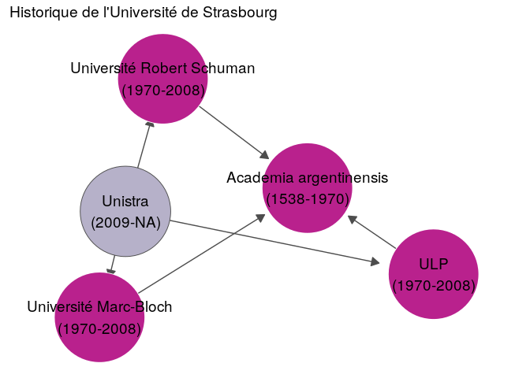
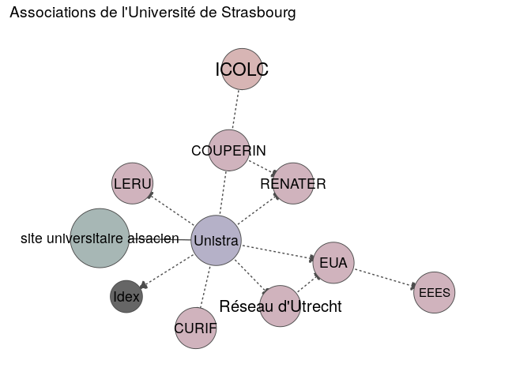
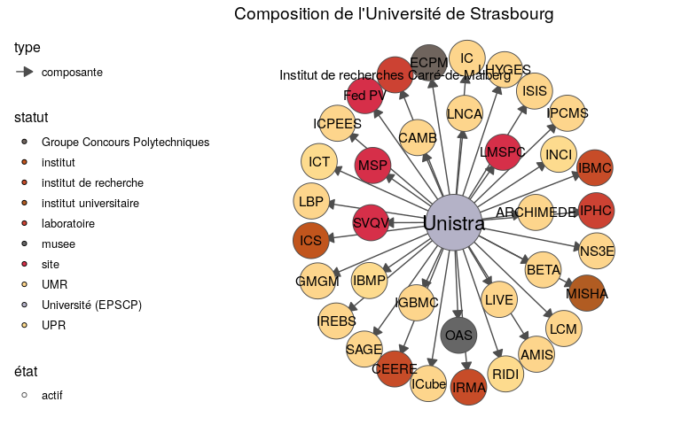
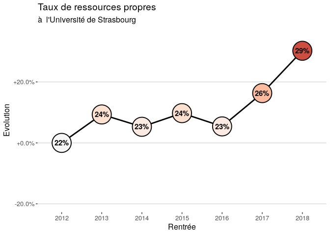
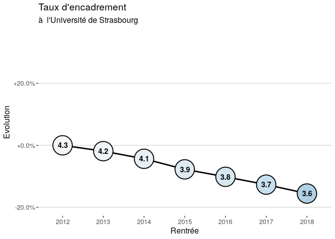
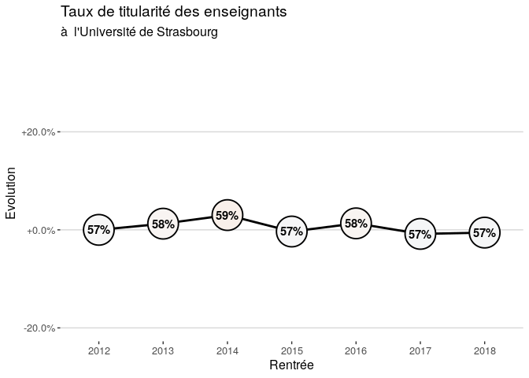
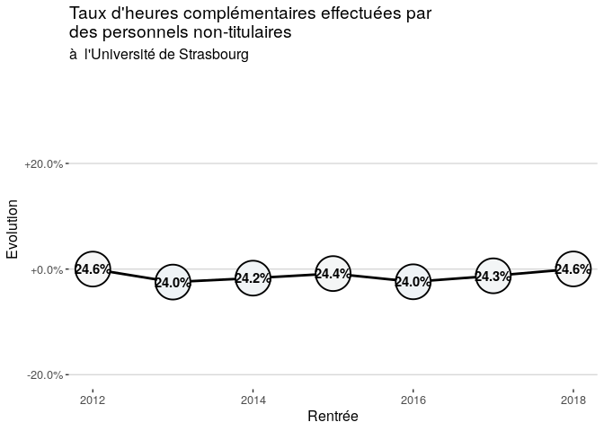
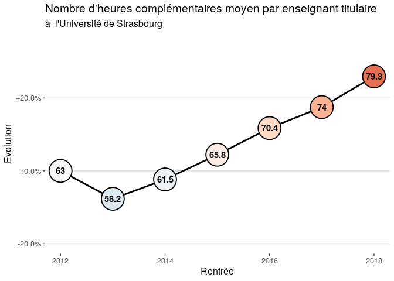
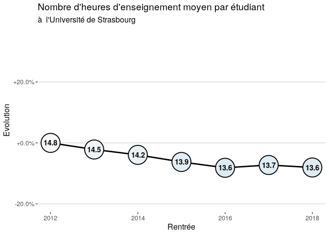

Fiche Bilan-Projet Université de Strasbourg
================
CPESR
28/09/2020

**Attention :** Ce document est un pur brouillon, seulement à visée de
discussion. Il a vocation à devenir une trame permettant aux acteurs
locaux de l’adapter à leurs propres besoins.

Cette fiche bilan-projet vise à faciliter les élections dans les
conseils centraux des universités en fournissant une information
objective et uniformisée sur l’établissement, et en permettant aux
candidats d’afficher une intention politique structurée et standardisée.

Elle ne prétend ni couvrir l’intégralité des politiques universitaires,
ni capturer toute la complexité des sujets qu’elle aborde. Cependant,
son appropriation par les candidats et électeurs doit permettre de poser
les bases d’un débat électoral sur le projet détablissement.

Elle se base pour l’essentiel sur la méthodologie utilisée pour élaborer
les [tableaux de bord de
l’ESR](https://cpesr.fr/2020/09/tableau-de-bord-esr/).

## Structure et organisation

### Historique

L’historique montre les grandes étapes qui ont conduit à l’établissement
actuel.

<!-- -->

*Futur envisagé : Est-ce que des fusions ou fissions sont envisagées ?*

### Associations

Les associations montrent les adhésions à des organisations externes à
l’établissement.

<!-- -->

*Futur envisagé : Est-ce que des créations ou suppressions
d’associations sont envisagées ?*

### Composition

La composition montre la structuration interne de l’établissement.

<!-- -->

*Futur envisagé : Est-ce que des modifications de la structure interne
sont envisagées ?*

## Indicateurs clés de performance

### Taux de ressources propres

*Définition.* Le taux de ressources propres mesure les moyens que
l’établissement obtient en plus des subventions de service public
versées l’Etat. Ces moyens regroupent notamment les financements sur
projet et les frais de scolarité. Il reflêtent donc à la fois le
dynamisme de l’établissement et sa volonté de commercialiser ses
services. La source principale de ressources propres reste les frais
d’inscription des étudiants.

Le taux de ressources propres médian des universités en 2018 est : 18%.

<!-- -->

*Observation :* Le Taux de ressources propres de l’Université de
Strasbourg est passé de 22% en 2012 (classement : 4/68) à 29% en 2018
(classement : 4/68). Son évolution sur cette période est de +30.2%.

*Positionnement politique :* D’après vous, cette politique est :

  - \[ \] souhaitable et prioritaire.
  - \[ \] souhaitable.
  - \[ \] non souhaitable mais inévitable.
  - \[ \] nos souhaitable et doit être évitée.

*Commentaires :*

### Taux de d’encadrement

*Définition.* Le taux d’encadrement est une mesure de la politique RH de
l’établissement. Il indique le nombre d’enseignants titulaires pour 100
étudiants (doctorants non inclus).

Le taux d’encadrement médian des universités en 2018 est : 4.1.

<!-- -->

*Observation :* Le Taux d’encadrement de l’Université de Strasbourg est
passé de 4.3 en 2012 (classement : 38/68) à 3.6 en 2018 (classement :
48/68). Son évolution sur cette période est de -15.6%.

*Positionnement politique :* D’après vous, cette politique est :

  - \[ \] souhaitable et prioritaire.
  - \[ \] souhaitable.
  - \[ \] non souhaitable mais inévitable.
  - \[ \] nos souhaitable et doit être évitée.

*Commentaires :*

### Taux de titularité des enseignants

*Définition.* Le taux de titularité des enseignants est une mesure de la
politique RH de l’établissement. Il indique la proportion d’enseignants
titulaires parmi tous les enseignants : titulaires, doctorants avec
mission d’enseignement et contractuels type LRU, exceptés les
vacataires, pour lesquels les données nationales manquent malgré qu’ils
puissent être plus nombreux que les enseignants titulaires.

Le taux de titularité médian des universités en 2018 est : 58%.

<!-- -->

*Observation :* Le Taux de titularité des enseignants de l’Université de
Strasbourg est passé de 57% en 2012 (classement : 45/68) à 57% en 2018
(classement : 40/68). Son évolution sur cette période est de -0.6%.

*Positionnement politique :* D’après vous, cette politique est :

  - \[ \] souhaitable et prioritaire.
  - \[ \] souhaitable.
  - \[ \] non souhaitable mais inévitable.
  - \[ \] nos souhaitable et doit être évitée.

*Commentaires
:*

### Le taux d’heures d’enseignement complémentaires effectuées par des personnels non-titulaires

*Définition.* Le taux d’heures d’enseignement complémentaires effectuées
par des personnels non-titulaires est une mesure de la politique RH de
l’établissement. Il indique la proportion des enseignements qui sont
assurées par des vacataires.

<!-- -->

*Observation :* Le Taux d’heures complémentaires effectuées par des
personnels non-titulaires de l’Université de Strasbourg est passé de
24.6% en 2012 à 24.6% en 2018. Son évolution sur cette période est de
+0.0%.

*Positionnement politique :* D’après vous, cette politique est :

  - \[ \] souhaitable et prioritaire.
  - \[ \] souhaitable.
  - \[ \] non souhaitable mais inévitable.
  - \[ \] nos souhaitable et doit être évitée.

*Commentaires :*

### Nombre d’heures complémentaires moyen par enseignant titulaire

*Définition.* Le nombre d’heures complémentaires moyen par enseignant
titulaire est une mesure des politiques RH et d’enseignement de
l’établissement. Il indique, en moyenne, combien d’heures doivent
effectuer les enseignants et enseignants-chercheurs au delà de leur
service statutaire. Il ne permet pas de capturer l’hétérogénité de cette
charge entre les personnels.

<!-- -->

*Observation :* Le Nombre d’heures complémentaires moyen par enseignant
titulaire de l’Université de Strasbourg est passé de 63 en 2012 à 79.3
en 2018. Son évolution sur cette période est de +25.9%.

*Positionnement politique :* D’après vous, cette politique est :

  - \[ \] souhaitable et prioritaire.
  - \[ \] souhaitable.
  - \[ \] non souhaitable mais inévitable.
  - \[ \] nos souhaitable et doit être évitée.

*Commentaires :*

### Nombre d’heures d’enseignement moyen par étudiant

*Définition.* Le nombre d’heures d’enseignement moyen par étudiant est
une mesure de la politique d’enseignement de l’établissement. Il reflète
à la fois le volume d’heures délivré et la taille des groupes : il
augmente avec la diversité de l’offre de formation et le nombre d’heures
par formation, et il baisse avec le nombre d’étudiants par groupe. Il ne
capture par l’hétérogénité des formations de l’établissement.

<!-- -->

*Observation :* Le Nombre d’heures d’enseignement moyen par étudiant de
l’Université de Strasbourg est passé de 14.8 en 2012 à 13.6 en 2018. Son
évolution sur cette période est de -8.1%.

*Positionnement politique :* D’après vous, cette politique est :

  - \[ \] souhaitable et prioritaire.
  - \[ \] souhaitable.
  - \[ \] non souhaitable mais inévitable.
  - \[ \] nos souhaitable et doit être évitée.

*Commentaires :*
