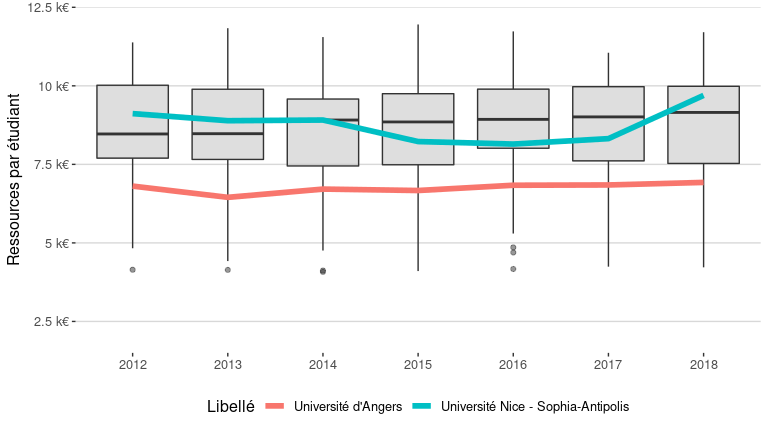

versus
================
Julien Gossa
23/10/2020

Attention, ceci n’est qu’un brouillon.

``` r
df.all <- esr %>% filter(as.character(Rentrée) > 2011, Type == "Université")
df.etabs <- df.all %>% filter(UAI %in% uais)

ggplot(df.etabs,aes(x=Rentrée,y=kpi.K.resPetu)) +
  geom_boxplot(data = df.all, fill="grey", alpha=0.5) +
  geom_line(aes(group=Libellé, color=Libellé), size = 2) +
  scale_y_continuous(limits=c(0,12000), name = "Ressources par étudiant", labels = euro_k) +
  theme_hc()
```

    ## Warning: Removed 73 rows containing non-finite values (stat_boxplot).

<!-- -->

``` r
ggplot(df.etabs ,aes(x=Rentrée,y=kpi.K.titPetu)) +
  geom_boxplot(data = df.all, fill="grey", alpha=0.5) +
  geom_line(aes(group=Libellé, color=Libellé), size = 2) +
  scale_y_continuous(name = "Taux d'encadrement") +
  theme_hc()
```

    ## Warning: Removed 1 rows containing non-finite values (stat_boxplot).

<!-- -->

``` r
ggplot(df.etabs ,aes(x=Rentrée,y=kpi.K.proPres)) +
  geom_boxplot(data = df.all, fill="grey", alpha=0.5) +
  geom_line(aes(group=Libellé, color=Libellé), size = 2) +
  scale_y_continuous(name = "Taux de ressrouces propres", labels=scales::percent) +
  theme_hc()
```

    ## Warning: Removed 43 rows containing non-finite values (stat_boxplot).

<!-- -->
